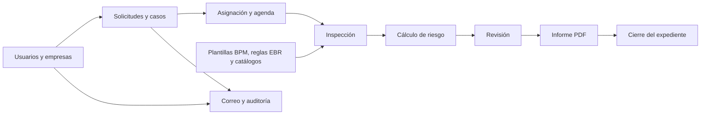
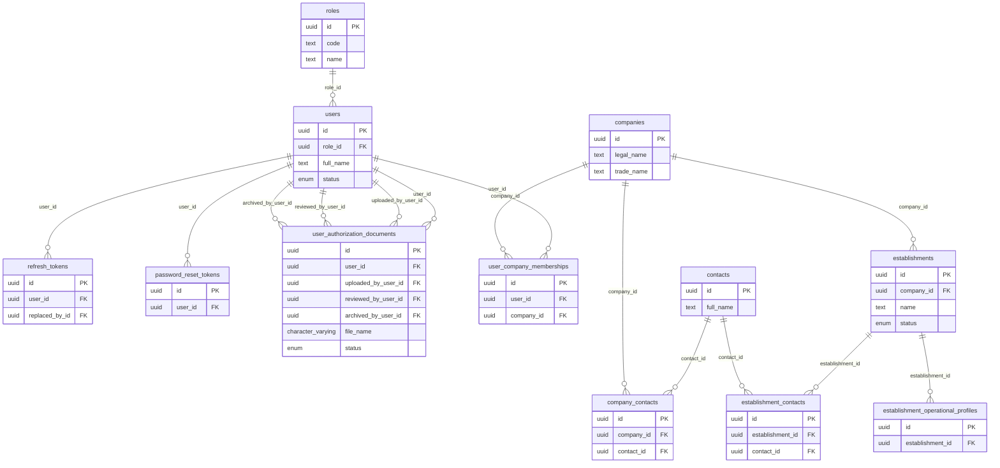
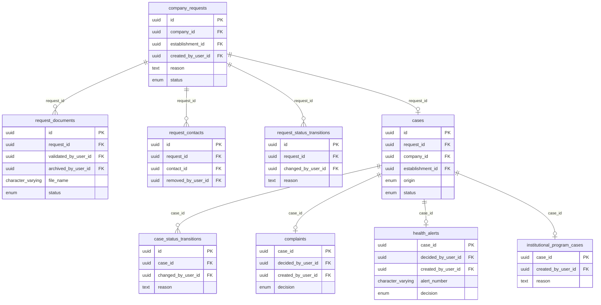
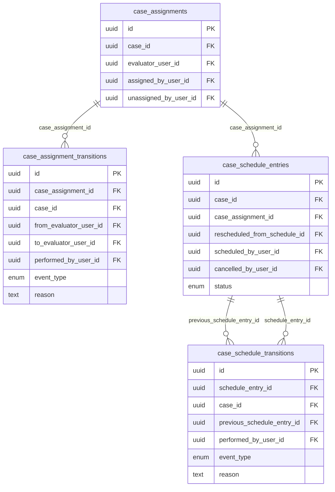
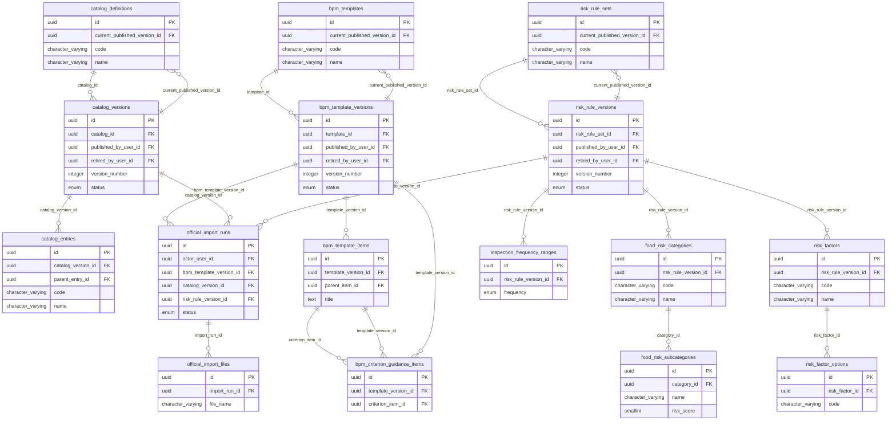
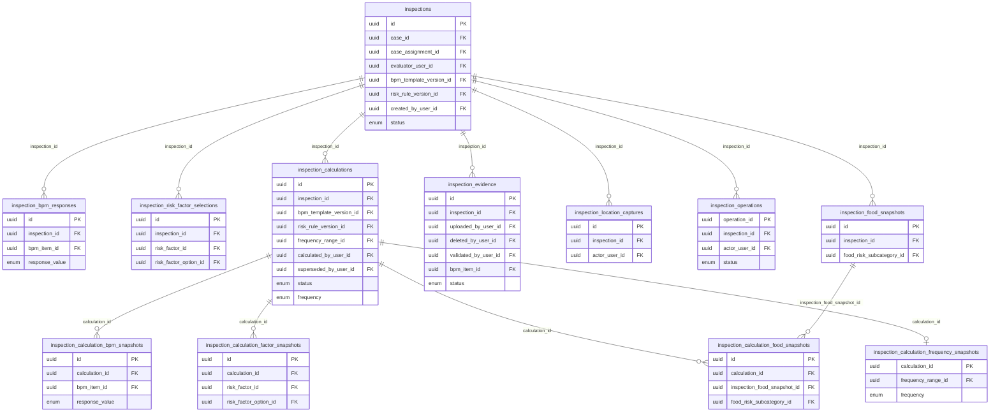
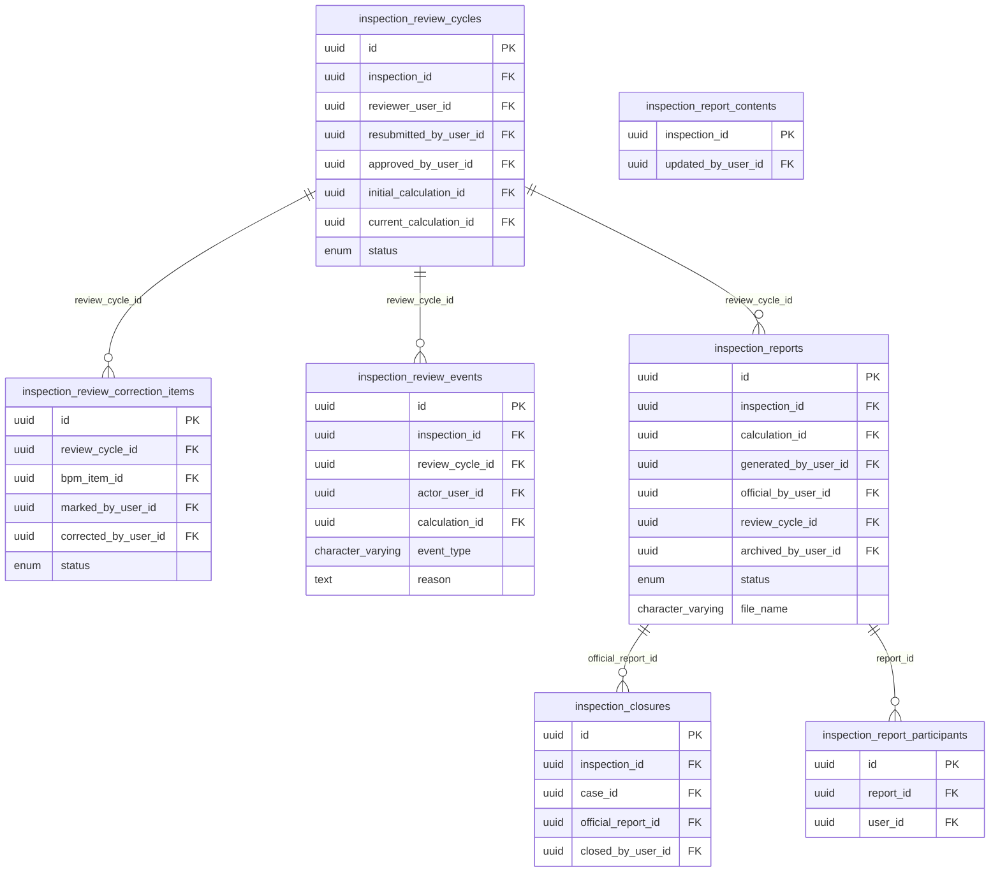
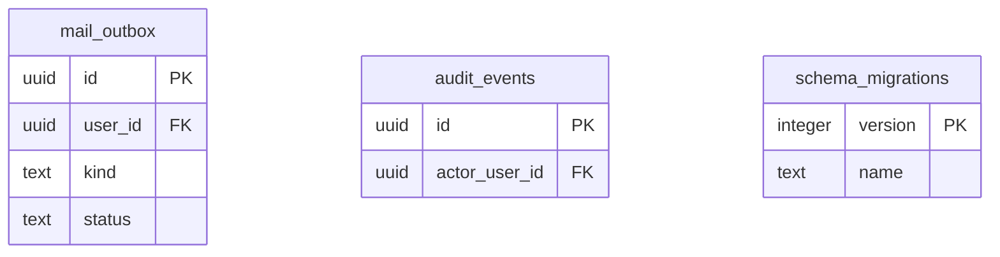

# Diagrama de la base de datos de SIRA Tech

Esquema PostgreSQL consultado en modo **solo lectura**. Se encontraron **63 tablas**. Última migración aplicada: **0040_report_content**.

Cada bloque muestra las tablas principales de un área. `PK` identifica la clave primaria y `FK` una referencia a otra tabla. Las líneas representan claves foráneas reales de PostgreSQL. Para mantener cada vista legible, las referencias a tablas de otra área se explican en el mapa general y no se repiten en cada bloque.

## Mapa general

## Identidad, empresas y contactos

## Solicitudes y origen de casos

## Asignación y agenda

## Catálogos, plantillas BPM y reglas EBR

## Inspección y cálculo

## Revisión, informes y cierre

## Soporte y trazabilidad

## Relaciones entre áreas

- Un usuario tiene un rol y puede pertenecer a una empresa. Una empresa puede tener establecimientos y contactos.
- Una solicitud empresarial apunta a una empresa y un establecimiento. Un caso puede originarse en una solicitud, una denuncia, una alerta LAPCH o un programa institucional.
- Un caso puede tener asignaciones y entradas de agenda. Una inspección pertenece a un caso y a un evaluador; toma versiones concretas de la plantilla BPM y de la regla EBR.
- Las respuestas BPM, selecciones de factores, productos, evidencias y ubicaciones pertenecen a la inspección. Los cálculos guardan instantáneas para preservar el resultado histórico.
- La revisión puede devolver criterios para corrección. Los informes se generan a partir de un cálculo; el cierre exige un informe oficial.

## Cómo intervienen las migraciones

Las migraciones `*.up.sql` crean o modifican tablas, columnas, índices, restricciones y reglas; `*.down.sql` describe el retroceso correspondiente. `schema_migrations` registra qué versiones se aplicaron. **El diagrama representa el estado final de la base consultada, no un archivo SQL aislado.** Al añadir una migración y aplicarla, vuelva a ejecutar `node scripts/generate-db-diagram.mjs` desde la raíz del repositorio para actualizar este documento. El comando solo consulta metadatos y reescribe este Markdown; no modifica datos de la base.

Para verificar antes que la base corresponde a los archivos del proyecto: `npm run db:verify --workspace @ebr-bpm/api`. Si el diagrama muestra una migración anterior a la última del repositorio, aplique primero las pendientes en el entorno correcto.
